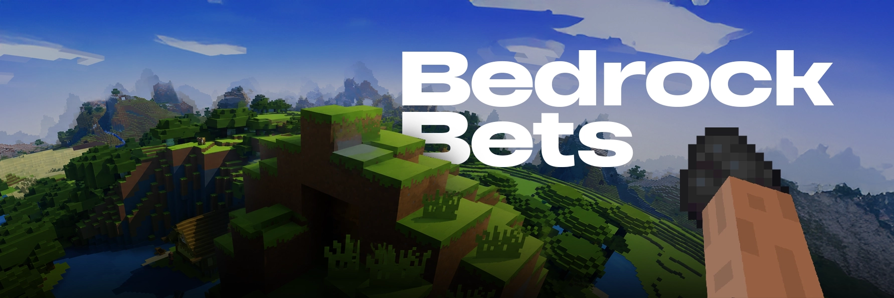

<div align="center">



# BedrockBet

**Prediction market plugin for Minecraft — bet on real gameplay events**

[](https://papermc.io/)
[](https://adoptium.net/)
[](LICENSE)
[](https://bedrockbet.fun)

[Website](https://bedrockbet.fun) · [Twitter/X](https://x.com/BedrockBets) · [Report Bug](https://github.com/ChainRiftX/bedrockbet-plugin/issues)

</div>

---

## About

BedrockBet turns your Minecraft server into a prediction market. Players create markets on in-game events — kills, deaths, block mining, weather, coordinates, and more — then bet **YES** or **NO** by holding items in hand. Winners split the entire pool proportionally, paid out in items automatically.

## Features

- **12 Market Types** — kills, deaths, block break/place, item pickup/drop, held item, position, height, distance, weather, XP level
- **Item-Based Betting** — hold items in hand to bet; winners receive items back
- **Item Value Table** — denominations from Coal (1) to Netherite Ingot (500)
- **Interactive GUI** — browse, filter, and bet through a chest-style interface
- **Floating Leaderboard** — hologram showing top winners (Text Display entities)
- **Live Sidebar** — scoreboard displaying held item value, auto-updates every 2s
- **Detailed Statistics** — kills, deaths, blocks, movement, mobs, and more
- **Async & Lag-Free** — all database reads run asynchronously

## Quick Start

```
1. Download bedrockbet-1.0.jar from Releases
2. Drop into your server's plugins/ folder
3. Restart the server
4. Edit plugins/BedrockBet/config.yml if needed
5. Done — players can start creating markets!
```

## Market Types

| Type | Description | Example |
|------|-------------|---------|
| `kill` | Player kills another player or mob | `/market kill Steve Alex >=5 5m` |
| `deaths` | Player dies N times | `/market deaths Steve =0 3m` |
| `break` | Player breaks a block type | `/market break Steve DIAMOND_ORE >=3 10m` |
| `place` | Player places a block type | `/market place Steve DIRT >=20 5m` |
| `pickup` | Player picks up an item | `/market pickup Steve DIAMOND >=10 5m` |
| `drop` | Player drops an item | `/market drop Steve DIAMOND >=5 5m` |
| `held` | Player holds an item in hand | `/market held Steve DIAMOND_SWORD >=3 5m` |
| `level` | Player reaches an XP level | `/market level Steve >10 5m` |
| `pos` | Player reaches coordinates | `/market pos Steve y>256 x>100 5m` |
| `height` | Player reaches a Y level | `/market height Steve >256 5m` |
| `distance` | Player travels N blocks | `/market distance Steve >500 5m` |
| `weather` | Weather changes | `/market weather rain 5m` |

> Use `*` or `any` instead of a player name for "any player" markets.
> Time formats: `30s`, `5m`, `1h`.

## Item Value Table

| Item | Value |
|------|------:|
| Netherite Ingot | 500 |
| Diamond | 100 |
| Emerald | 50 |
| Gold Ingot | 10 |
| Iron Ingot | 5 |
| Lapis Lazuli | 3 |
| Copper Ingot | 2 |
| Coal | 1 |

Use `/market values` in-game to view the table.

## How Betting Works

1. A market is created with a condition and a timer
2. Players hold items in hand and bet **YES** or **NO**
3. Items are taken from hand immediately — their value becomes the bet amount
4. If the condition is met before time runs out — **YES wins**
5. If the timer expires without the condition being met — **NO wins**
6. Winners split the entire pool: `payout = total_pool * (your_bet / winning_side_pool)`
7. Winners receive items back based on their payout (highest denomination first)

## Commands

### Markets
| Command | Description |
|---------|-------------|
| `/market <type> <args> <time>` | Create a new market |
| `/market bet <id> <yes\|no>` | Bet held items on a market |
| `/market list` | Show active markets |
| `/market info <id>` | Market details and bet breakdown |
| `/market get <id>` | Private view of your bet |
| `/market balance` | Check held item value |
| `/market values` | Show item value table |

> Aliases: `/bet`, `/m`

### GUI
| Command | Description |
|---------|-------------|
| `/markets` | Open the interactive markets GUI |

> Aliases: `/bets`

### Statistics
| Command | Description |
|---------|-------------|
| `/stats` | Global server statistics |
| `/stats player [name]` | Individual player breakdown |
| `/stats mobs` | Top 10 most-killed mob types |
| `/stats top <deaths\|kills>` | Top 10 players leaderboard |
| `/stats reset` | Reset all stats (admin only) |

### Leaderboard (OP only)
| Command | Description |
|---------|-------------|
| `/leaderboard create` | Spawn a floating hologram at your location |
| `/leaderboard remove` | Remove the nearest hologram (10 block radius) |
| `/leaderboard removeall` | Remove all holograms |

> Aliases: `/lb`, `/top`

## Tracked Events

The plugin listens for the following in-game events and feeds them into the market system:

- **Deaths** — player and mob deaths with killer info
- **Movement** — block-level position changes
- **Block break / place** — with material tracking
- **Item pickup / drop** — with material and amount
- **Held item** — main hand item switches
- **Weather** — rain start/stop
- **XP level** — level-up events

All events are also aggregated into the `/stats` system.

## Technical Details

| | |
|---|---|
| **Platform** | Paper 1.20.4+ |
| **Database** | SQLite (automatic, stored in plugin data folder) |
| **Persistence** | Market progress saved to `market_progress.json` every 30s |
| **Async** | All database reads run asynchronously |
| **Scoreboard** | Auto-updates every 2 seconds |
| **Leaderboard** | Auto-updates every 5 seconds, billboard Text Display entities |

## Links

| | |
|---|---|
| **Website** | [bedrockbet.xyz](bedrockbet.xyz) |
| **Twitter/X** | [@BedrockBets](https://x.com/BedrockBets) |
